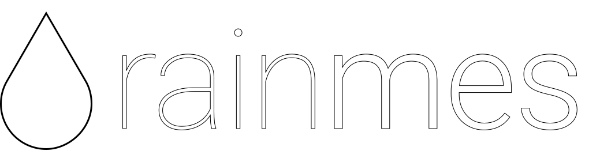

rainmes is a platform for agriculturists and hobbyists to visualize rainfall data along with contributing data to it.

URL: coming soon!

Stage: In development

## Development Instructions

    npm install
    npm run dev

- Auto rebuild on code change is enabled by default
